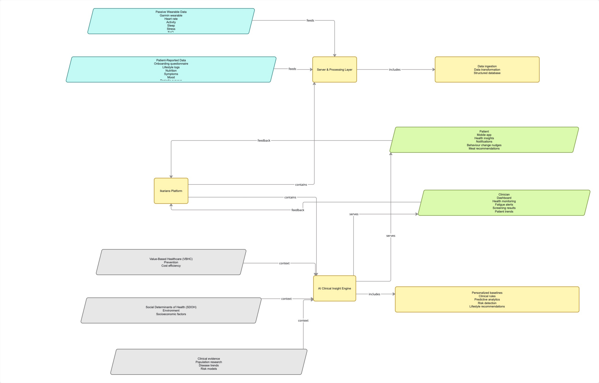

# Health Data Ecosystem Map

*Original: [`../06-supporting-evidence/healthdata_ecosystem_map_John.pdf`](../06-supporting-evidence/healthdata_ecosystem_map_John.pdf)*

## Reading the map

**Inputs (top left, cyan):**
- **Passive wearable data** from the Garmin device — heart rate, activity,
  sleep, stress, SpO₂
- **Patient-reported data** from onboarding and daily lifestyle logs —
  nutrition, symptoms, mood, periodic surveys

**Processing (centre, yellow):**
Both feed into a Server & Processing Layer handling ingestion,
transformation and storage, which in turn feeds the Ikarians Platform and
its AI Clinical Insight Engine.

**Context (bottom left, grey):**
The AI engine does not reason from patient data alone. It also draws on
Value-Based Healthcare principles, Social Determinants of Health, and
broader clinical evidence. This is effectively the mechanism through which
Ikarians' internal clinical knowledge (see
[`../01-project-context/evidence-landscape.md`](../01-project-context/evidence-landscape.md))
is applied to an individual patient's data.

**Outputs (right, green):**
- Patient-facing: insights, notifications, behaviour nudges, meal
  recommendations
- Clinician-facing: monitoring dashboard, fatigue alerts, screening
  results, patient trends

**Feedback loops:** both interfaces feed back into the platform. Patient
and clinician actions are not just terminal outputs; they are also new
data re-entering the system.

## What this makes explicit
The Dictionary fully shows on its own; the AI's outputs depend on both patient
data and external clinical context. A perfectly clean patient dataset
would still be insufficient if the contextual evidence layer behind it is
thin, a point that is talked about in the quality and AI-readiness assessments
later on.
